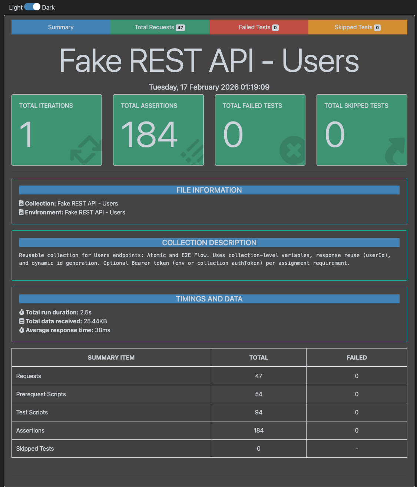

# API Tests

API testing for **Fake REST API** [Users](https://fakerestapi.azurewebsites.net/swagger/v1/swagger.json) endpoints. Postman/Newman collection with four modules: \
**Atomic** (per-endpoint tests) \
**Boundary** (int32/string/nullable edge cases) \
**Content-Type** (request/response media type negotiation) \
**E2E Flow** (full lifecycle). Uses variables, response reuse, schema validation, and a mocked Bearer token.

## Demo
[](https://asciinema.org/a/Odv6LIdnmVgSJvtm)

## Contents

| Tool            | Folder    | Status      |
|-----------------|-----------|-------------|
| Postman / Newman | [postman/](postman/) | Implemented |

---

## Quick start (Postman UI)

1. Import into Postman:
   - **Collection**: [postman/FakeRESTAPI-Users.postman_collection.json](postman/FakeRESTAPI-Users.postman_collection.json)
   - **Environment**: [postman/postman_environment.json](postman/postman_environment.json)
2. Select the environment and run the collection (or a single folder).

The collection works immediately after import. Authentication is configured at the collection level (Bearer token).

## Quick start (Newman CLI)

```bash
npm install
npm run test:postman
```

Open `reports/newman/report.html` for the HTML report.

## Quick start (Docker)

No Node.js or npm required — only Docker. Uses the official [`postman/newman:alpine`](https://hub.docker.com/r/postman/newman/) image:

```bash
bash scripts/docker-test.sh
```

Pass arguments to run specific folders or bail on failure:

```bash
npm run test:docker                                    # full collection
npm run test:docker -- --folder "Users – E2E Flow"      # single folder
npm run test:docker -- --bail --folder "Users – Atomic"  # bail on first failure
```

Or call the script directly: `bash scripts/docker-test.sh` (same options).

JUnit report is written to `reports/newman/junit.xml`.

---

## Variables

### Environment (postman_environment.json)

| Variable    | Purpose                                                                 |
|-------------|-------------------------------------------------------------------------|
| `baseUrl`   | API base URL (default `https://fakerestapi.azurewebsites.net`)         |
| `authToken` | Mock Bearer token. Default `mock-jwt-token-2026`.                       |

### Collection-level (defaults, some set by scripts)

| Variable              | Purpose                                                                 |
|-----------------------|-------------------------------------------------------------------------|
| `baseUrl`             | Fallback base URL (env overrides when present)                          |
| `authToken`           | Fallback mock token (env overrides when present)                        |
| `userId`              | Set from POST response; reused in GET/PUT/DELETE                        |
| `userName`, `password`| Generated in pre-request for POST/PUT payloads                           |
| `randomIdInRange`     | Random int in `[idMin, idMax]` for equivalence tests (generated per-request) |
| `idMin`, `idMax`      | Bounds for random id (default 1–100)                                     |
| `firstUserIdFromList` | Set from first element of GET /Users; fallback when POST returns id 0    |
| `longString`          | Generated in pre-request for string boundary tests (10 000 chars)        |

## Headers

- **Accept**: `application/json; v=1.0` – set on every request via pre-request script.
- **Content-Type**: `application/json; v=1.0` – on every POST and PUT with a JSON body (overridden in Content-Type tests).
- **Authorization**: `Bearer {{authToken}}` – set via collection-level auth config (visible in Postman UI Authorization tab).

---

## Modules

### Users – Atomic

Per-endpoint positive, negative, and equivalence tests. Run top-to-bottom so POST sets `userId` before GET/PUT/DELETE.

- **GET /api/v1/Users** – list (200, array); schema validation; sets `firstUserIdFromList`.
- **POST /api/v1/Users** – positive: create (200), sets `userId`, schema + userName match.
- **POST /api/v1/Users** – negative: empty body, missing fields, invalid types (400).
- **GET /api/v1/Users/{{userId}}** – get created user (200); schema validation.
- **GET /api/v1/Users/{{randomIdInRange}}** – equivalence (200 or 404).
- **GET /api/v1/Users/1** – boundary positive (200).
- **GET /api/v1/Users/0** – boundary negative (404/400).
- **GET /api/v1/Users/999999** – negative (404).
- **PUT /api/v1/Users/{{userId}}** – update (200); schema and userName prefix assertion.
- **PUT /api/v1/Users/999999** – negative (200 upsert or 404).
- **PUT /api/v1/Users/null** – negative (400).
- **DELETE /api/v1/Users/{{userId}}** – delete (200).
- **DELETE /api/v1/Users/999999** – negative (200 or 404).

### Users – Boundary

Data-type boundary tests for the User model. Can run standalone.

- **int32 path boundaries**: GET/PUT/DELETE with id = -1, 2147483647 (max), -2147483648 (min), 2147483648 (overflow → 400).
- **int32 body boundaries**: POST with id = 2147483647, -1, 2147483648 (overflow → 400).
- **String boundaries**: POST with empty strings, 10 000-char strings, special characters (`<script>`, SQL injection patterns).
- **Nullable boundaries**: POST and PUT with explicit `null` for userName and password (swagger defines these as nullable).

### Users – Content-Type

Content negotiation tests. Can run standalone.

- **Request Content-Type** (POST & PUT): `text/json` (200), `application/*+json` (200), `text/plain` (415), `application/xml` (415), no header (415).
- **Accept header** (GET): `text/json`, `text/plain`, `application/xml` – API ignores Accept and always returns `application/json`.

### Users – E2E Flow

Single flow: **POST → GET → PUT → GET (verify update) → DELETE → GET (404)**. All use `{{userId}}` from the POST in step 1. Can be run standalone. This folder is used as the **smoke** suite in CI.

---

## Scripts (Newman)

| Script                           | Description |
|----------------------------------|-------------|
| `npm run test:postman`           | Full collection (all 4 folders) |
| `npm run test:postman:ci`        | Full collection with `--ci` (bail on first failure); used by **Regression** workflow |
| `npm run test:postman:smoke:ci`  | E2E Flow folder only with `--ci`; used by **Smoke** workflow |
| `npm run test:postman:atomic`    | Users – Atomic folder only |
| `npm run test:postman:boundary`  | Users – Boundary folder only |
| `npm run test:postman:content-type` | Users – Content-Type folder only |
| `npm run test:postman:e2e`       | Users – E2E Flow folder only |
| `npm run test:docker`            | Full collection via [`postman/newman:alpine`](https://hub.docker.com/r/postman/newman/) Docker image (no local Node.js required) |

Pass one or more folders explicitly:

```bash
node --no-deprecation scripts/run-newman.js --folder "Users – Atomic" --folder "Users – Boundary"
```

**Reports:** `reports/newman/report.html`, `reports/newman/junit.xml`, `reports/newman/coverage-summary.txt`.

Direct Newman:

```bash
npx newman run postman/FakeRESTAPI-Users.postman_collection.json \
  -e postman/postman_environment.json \
  --reporters cli,htmlextra,junit \
  --reporter-htmlextra-export reports/newman/report.html \
  --reporter-junit-export reports/newman/junit.xml
```

**Reports example:**



---

## CI (GitHub Actions)

Workflows in [.github/workflows/](.github/workflows/):

| Workflow   | File | Trigger                    | Command |
|------------|------|----------------------------|---------|
| **Smoke**  | [smoke.yml](.github/workflows/smoke.yml) | Push to `main`/`master`, or manual | `npm run test:postman:smoke:ci` |
| **Regression** | [regression.yml](.github/workflows/regression.yml) | Manual only | `npm run test:postman:ci` |

Each workflow installs deps, runs Newman, publishes test results (JUnit), and uploads `reports/newman/` as an artifact. **Secrets** (optional): `BASE_URL`, `AUTH_TOKEN`. For manual runs: **Actions** → select workflow → **Run workflow**.

---

## Coverage matrix (endpoint × scenario)

| Endpoint                  | Scenario       | Request names |
|---------------------------|----------------|---------------|
| GET /api/v1/Users         | positive       | GET Users (list) – positive |
| GET /api/v1/Users         | content-type   | GET list – Accept text/json, text/plain, application/xml |
| POST /api/v1/Users        | positive       | POST User – positive, 1. POST User |
| POST /api/v1/Users        | negative       | POST User – empty body, missing fields, invalid types |
| POST /api/v1/Users        | int32 boundary | POST User id=2147483647, id=-1, id=2147483648 |
| POST /api/v1/Users        | string boundary| POST User – empty strings, long strings, special characters |
| POST /api/v1/Users        | nullable       | POST User – null fields |
| POST /api/v1/Users        | content-type   | POST – text/json, application/*+json, text/plain, application/xml, no Content-Type |
| GET /api/v1/Users/{id}    | positive       | GET User by id (userId from POST), 2. GET User by id, 4. GET User by id (verify update) |
| GET /api/v1/Users/{id}    | equivalence    | GET User by randomIdInRange |
| GET /api/v1/Users/{id}    | boundary       | GET User by id=1, id=0, id=-1, id=2147483647, id=-2147483648, id=2147483648 |
| GET /api/v1/Users/{id}    | negative       | GET User by id=999999, 6. GET User by id (expect 404) |
| GET /api/v1/Users/{id}    | content-type   | GET by id – Accept text/json |
| PUT /api/v1/Users/{id}    | positive       | PUT User by userId, 3. PUT User |
| PUT /api/v1/Users/{id}    | negative       | PUT User by id=999999, PUT User by id=null, PUT User id=-1 |
| PUT /api/v1/Users/{id}    | nullable       | PUT User – null fields |
| PUT /api/v1/Users/{id}    | content-type   | PUT – text/json, application/*+json, text/plain |
| DELETE /api/v1/Users/{id} | positive       | DELETE User by userId, 5. DELETE User |
| DELETE /api/v1/Users/{id} | negative       | DELETE User by id=999999, DELETE User id=-1 |

All five endpoints are covered across positive, negative, boundary, nullable, equivalence, and content-type scenarios. Summary is written to `reports/newman/coverage-summary.txt` after each run.
